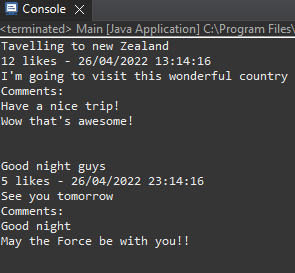

# Java social media post practice

> ## In this practice I made a simple social media post, with the intent of training the use of Java classes and objects to store informations. Sample image of the program running bellow.
> 
